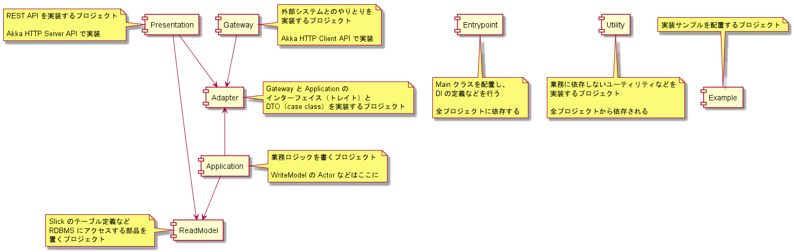

# lerna-sample-payment-app

Lernaを使って実装した「決済ゲートウェイ」アプリケーションのサンプルです。

## Application development guide

- アプリケーションを動かしてみる
    - [Demonstration](#demonstration)
- 開発環境を整えたい
    - [開発環境セットアップガイド](./docs/開発環境セットアップガイド.md)
    - [Docker コンテナ利用ガイド](./docker/README.md)
- プログラムを書きたい/レビューしたい
    - [プログラミングスタイルガイド](./docs/プログラミングスタイルガイド.md)
    - [デバッグガイド](./docs/デバッグガイド.md)
- 実装方法を知りたい
    - [サブプロジェクト特有の実装方針や注意点](docs/projects/README.md)
    - [DIコンポーネント実装ガイド](docs/DIコンポーネント実装ガイド.md)
    - [バリデーション実装ガイド](docs/バリデーション実装ガイド.md)
    - [RDBMSアクセス処理実装ガイド](docs/RDBMSアクセス処理実装ガイド.md)
    - [ログ実装ガイド](docs/ログ実装ガイド.md)
    - [外部システムモック実装ガイド](docs/外部システムモック実装ガイド.md)
    - [ClusterSharding の Entity を実装する際の注意点](docs/projects/application/ClusterShardingのEntityを実装する際の注意点.md)
    - [ReadModelUpdater用タグ付け](docs/projects/application/ReadModelUpdater用タグ付け.md)
- プロジェクトの運用作業をしたい
    - [RDBMSテーブル定義更新ガイド](docs/RDBMSテーブル定義更新ガイド.md)
    - [RPM パッケージビルドガイド](docs/RPMパッケージビルドガイド.md)

## Project layout

矢印は依存方向を表す。



この構成の目的や意図については [プロジェクト構成詳解](docs/プロジェクト構成詳解.md) を参照してください。

### Package layout

ルートパッケージの直下にプロジェクトを表すパッケージを配置し、
その配下にそのプロジェクトが担当する責務領域を表現するパッケージを配置します。

それぞれのプロジェクト専用のユーティリティがある場合は、各プロジェクト配下の `util` パッケージに配置します。

- jp.co.tis.lerna.payment
    - presentation
        - ecpayment: EC決済関連
        - management: 管理用内部向けAPI
        - util
    - gateway
        - issuing: IssuingService関連
        - notification: 通知関連
    - adapter （application と gateway のパッケージ構成をマージ）
        - ecpayment
        - issuing
        - notification
        - util
        - wallet
    - application
        - ecpayment: EC決済関連
        - readmodelupdater: 非同期 Read Model 更新関連
        - util
    - readmodel
        - constant: 定数定義
        - schema: Slick のテーブル定義関連
    - entrypoint
    - utility
        - lang: Scala の言語機能を拡張するユーティリティ
        - tenant: マルチテナント関連

## Changelog

[CHANGELOG](CHANGELOG.md) を参照

## Demonstration
1. 開発環境のセットアップ
    - [開発環境セットアップガイド](./docs/開発環境セットアップガイド.md) に従ってセットアップ
1. Cassandra起動
    - `docker-compose up -d cassandra`
1. Mock server起動
    - `docker-compose up -d mock`
1. MariaDB起動
   - `docker-compose up -d mariadb mariadb2`
1. コンパイル&テスト実行
   - `sbt clean test:compile test`
1. アプリ起動
    - 1 node目 `./start-app-1.sh`
    - 2 node目 `./start-app-2.sh`
    - 3 node目 `./start-app-3.sh` (option)
1. リクエスト
    ```shell
    curl \
      --silent --show-error --noproxy '*' \
      -H 'Authorization:Bearer dummy' -H 'Content-Type:application/json' -H 'X-Tenant-Id:example' \
      -X PUT \
      -d '{ "amount":600 }' \
      "http://127.0.0.1:9001/00/ec/settlements/000000000000000000000000000000000000002/$(date +%s%3N)/payment"
    ```

## APIs

### Management APIs

デフォルトではポート番号 `9002` が使用されます。

※ コマンド例を記載しています。`$` から始まるものがコマンドです。
実行結果例を空行を入れて記載しています。
実行結果は実行ごとに異なる値となることがあるのでご注意ください。

### Health Check

ヘルスチェックを行うための API です。  
正常に稼働していれば StatusCode 200 と レスポンスボディ `OK` が返ります。
```
$ curl -H 'X-Tenant-Id:example' http://127.0.0.1:9002/health

OK
```

### Metrics

アプリケーションの各種メトリクスを取得するための API です。

#### システム

- 使用済みJVMヒープ (byte)  
    ```
    $ curl --silent --show-error --noproxy '*' \
      http://127.0.0.1:9002/metrics/system-metrics/jvm-memory/heap/used
  
    306621099
    ```
- 最大JVMヒープ (byte)  
   ```
   $ curl --silent --show-error --noproxy '*' \
     http://127.0.0.1:9002/metrics/system-metrics/jvm-memory/heap/max
  
   3.765960704E9
   ```

#### テナントごと
- SalesDetail イベント処理に使用するイベントハンドラの数
    ```
    $ curl --silent --show-error --noproxy '*' \
      http://127.0.0.1:9002/metrics/rmu/sales_detail/ec_house_money/number_of_singleton?tenant=example
  
    25.0
    ```
- SalesDetail イベントが Cassandra に永続化されてから RMU で処理完了するまでの時間 (ms)
    ```
    $ curl --silent --show-error --noproxy '*' \
      http://127.0.0.1:9002/metrics/rmu/sales_detail/ec_house_money/update_delay?tenant=example
  
    3008
    ```

### バージョン情報

バージョン情報を取得するための API です。  
[RPMパッケージビルドガイド](docs/RPMパッケージビルドガイド.md) に従って RPM をビルドすることで、
そのRPMビルドには `unknown` ではない適切なバージョン番号とコミットハッシュが設定されます。

- バージョン番号
  ```
  $ curl --silent --show-error --noproxy '*' \
      http://127.0.0.1:9002/version
  
  unknown
  ```
- gitコミットハッシュ
  ```
  $ curl --silent --show-error --noproxy '*' \
      http://127.0.0.1:9002/commit-hash
  
  unknown
  ```

### グレースフルシャットダウン

- 新規処理の受付停止
    ```
    $ curl --silent --show-error --noproxy '*' \
        -X POST \
        http://127.0.0.1:9002/shutdown/hand-off-service
  
    新規処理の受付停止リクエストを受け付けました
    ```

## License

lerna-sample-payment-app is released under the terms of the [Apache License Version 2.0](LICENSE).

© 2020 TIS Inc.
